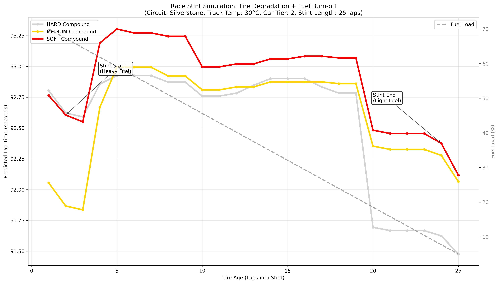
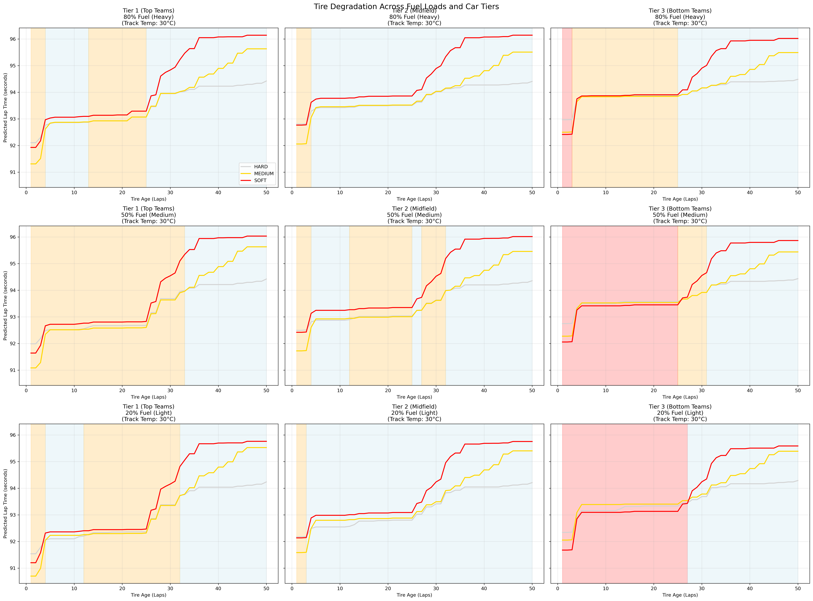

# F1 Tire Degradation Model

A machine learning model that predicts F1 lap times based on tire degradation, fuel load, track temperature, and car performance characteristics using real Formula 1 data.

## Key Features

- **Real F1 Data**: Uses FastF1 library to access official Formula 1 timing data
- **Synthetic Cliff Effects**: Intelligently adds synthetic data only where real data is sparse to ensure realistic tire degradation patterns
- **Circuit-Specific Modeling**: Accounts for unique fuel consumption rates across 25+ F1 circuits
- **Car Performance Tiers**: Models performance differences between top, midfield, and bottom teams
- **Realistic Race Simulation**: Shows tire degradation vs fuel burn-off effects during race stints
- **Monotonic Constraints**: Ensures physically realistic tire degradation patterns
- **Auto-Generated Visualizations**: High-quality plots automatically saved and organized by circuit

## Files Overview

| File | Purpose |
|------|---------|
| `main.py` | Main execution script - configure circuit and years here |
| `tire_model.py` | XGBoost model with 5-feature architecture and synthetic data generation |
| `data_collection.py` | F1 data gathering, circuit info, and preprocessing functions |
| `plotting.py` | All visualization functions with auto-save capabilities |
| `multi_circuit_analysis.py` | Batch analysis script for multiple circuits |
| `environment.yml` | Conda environment configuration |

## Quick Start

### 1. Setup Environment
```bash
# Create conda environment
conda env create -f environment.yml
conda activate f1-tire-model

# Or install via pip
pip install fastf1 pandas numpy xgboost scikit-learn matplotlib
```

### 2. Run Analysis
```bash
python main.py
```

### 3. Customize Circuit/Years
Edit `main.py` to analyze different circuits:
```python
circuit = "Silverstone"  # Change to any F1 circuit
years = [2022, 2023]     # Modify years as needed
```

### 4. Multi-Circuit Analysis
```bash
python multi_circuit_analysis.py  # Analyze 5 circuits automatically
```

## Results: Silverstone Analysis

### Model Performance
- **Training MAE**: 0.322 seconds
- **Test MAE**: 0.498 seconds  
- **Training R²**: 0.969
- **Test R²**: 0.920

The model achieves excellent predictive accuracy with sub-second error rates, indicating strong ability to capture tire degradation patterns.

### Feature Importance


**Key Insights:**
- Track temperature and fuel load are the dominant factors affecting lap times
- Car tier accounts for ~11% of performance variation between teams
- Tire compound and age have smaller but significant impacts

### Race Stint Simulation


**Realistic Modeling:**
- Shows competing effects: tire degradation (increasing lap times) vs fuel burn-off (decreasing lap times)
- Silverstone-specific fuel consumption: 3.3 kg/lap over 25-lap stint

### Tire Degradation by Car Tier


**Multi-Dimensional Analysis:**
- **Rows**: 80%, 50%, 20% fuel loads
- **Columns**: Tier 1, Tier 2, Tier 3 teams
- **Shading**: Highlights fastest compound at each tire age
- **Cliff Effects**: Synthetic data ensures realistic degradation beyond lap 25

**Team Performance Differences:**
- **Tier 1 teams**: Red Bull, Ferrari, Mercedes: Contenders with faster baseline performance
- **Tier 2 teams** (McLaren, Alpine, etc.): Midfield performance reference
- **Tier 3 teams** (Williams, Haas, etc.): Show more pronounced tire degradation

## Data Source & Preprocessing

### Data Collection
- **Source**: Official F1 timing data via FastF1 API
- **Circuits**: 25+ F1 tracks with circuit-specific fuel consumption rates
- **Years**: 2022-2023 seasons (easily extendable)
- **Data Points**: Lap times, tire compounds, tire age, track temperature, weather conditions

### Preprocessing Pipeline
1. **Data Filtering**: Remove outlier laps (pit stops, safety cars, invalid times)
2. **Synthetic Data Generation**: Add cliff effects where real data < 5 samples (long stints)
3. **Fuel Load Calculation**: Circuit-specific fuel burn rates and race progression modeling
4. **Car Tier Assignment**: Based on constructor championship standings
5. **Feature Engineering**: Encode categorical variables and normalize ranges

## Model Architecture

- **Algorithm**: XGBoost with monotonic constraints
- **Features**: Tire compound, tire age², track temperature, fuel load, car tier
- **Constraints**: Ensures tire age and fuel load correctly correlate with lap times
- **Synthetic Integration**: Real and synthetic data mixed in both training and test sets
- **Validation**: Train/test split with 80/20 random shuffle, early stopping

## Author

**Nikhil Gupta**

---

*Machine learning model for F1 tire degradation and lap time prediction.*